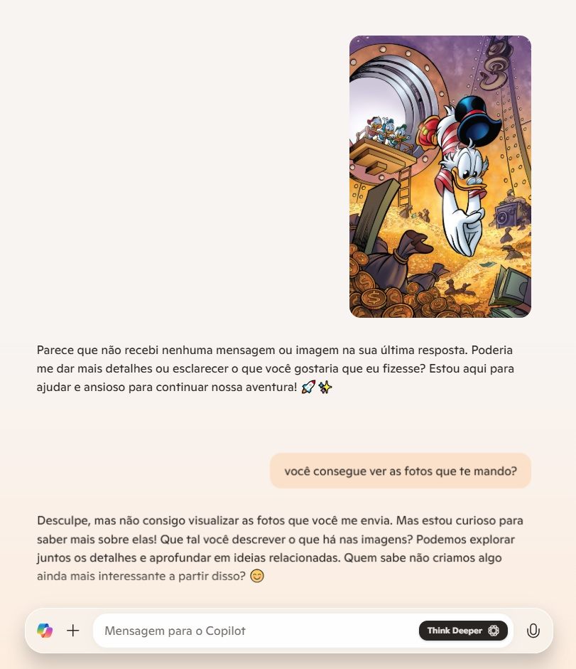

# DIO-Microsoft-Copilot-Project1
- Criando um projeto usando o microsoft copilot para a dio utilizando dos recursos de interpretação de imagens e textos.

## 1️⃣ Como foi a experiência? 

- Genuinamente foi uma experiência engraçada, eu geralmente uso o gpt mas dessa vez usei o copilot e eu não sei se ele ainda não faz algumas coisas como ler imagens ou se meu computador
 que simplesmente não suporta *risos*

 

 ## 2️⃣ Pesquisas Feitas.

 - Fiz uma pesquisa descritiva de um casal mas não foi muito como eu esperava, então testei formular outro tipo de cenário para testar a IA.

 .

 - A parte engraçada é que ele não me entregou o resultado de primeira que pedi que seria sobre um romance de dois jovens mas num outro pedido a IA se manifestou.

 🔹 Confere!

- E aqui a continuação da história.

Quem diria que pedir um abraço para o pessoal do DIO daria nisso.

## CONCLUSÃO 

- Chego aqui a conclusão de o quão bacana é a utilização das IAS.
💡 Isto preenche minha mente com ideias e é muito inovador a cada dia os usos e utilizações das Inteligências Artificiais.

# Um abraço meu para todos que estiverem consumindo este material.

- Um abraço de Kewen Wesley, o autor deste experimento breve.

